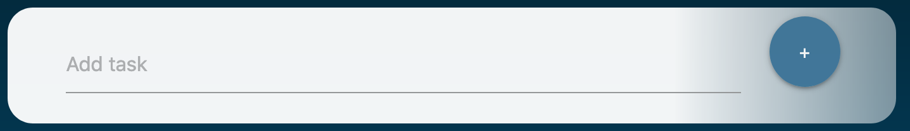
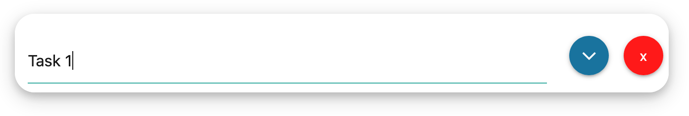
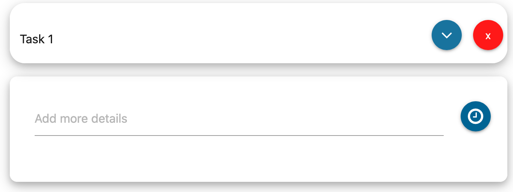
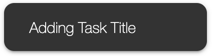
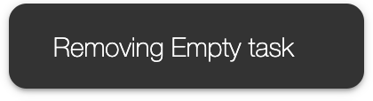
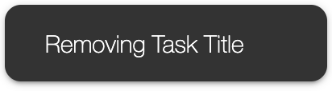
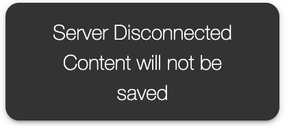

# to-do-app
### Built for MSA Program

1. #### Modify Tasks on the go !! (No need to refresh)
    * Type your task at 
    
    Click on `+` sign or just press <kbd>Enter</kbd>
    * Task will look like
    
    * To delete a task press on 
    * To Add details to a task press on 
    * Add extra details in the dropdown box
    
1. #### Toasts !!
    * 
    * 
    * 
    * 
    * 

1. #### Undo !!
    * Click on 
    * <kbd>Ctrl</kbd> + <kbd>Z</kbd> 
    * <kbd>Cmd</kbd> + <kbd>Z</kbd> 

1. #### Works Offline !!
    ##### DO NOT CLOSE THE TAB
    In case if your device gets disconnected the application will sync with the server once connection is established you will see  which will indicate that your tasks are being synced with the server
