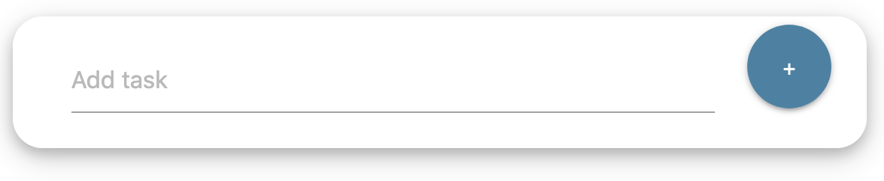

# to-do-app
### Built for MSA Program

Website: 
1. [todo.datascience.app](https://todo.datascience.app)  
1. [todo1.datascience.app](https://todo1.datascience.app)  

<br>

Status: &color=orange)  

<br>

Browsers Tested:    
<br>


- ### Features

    1. #### Modify Tasks on the go !! (No need to refresh)

        * Type your task at
            <br>
            Click on `+` sign or just press <kbd>Enter &crarr;</kbd>

        * Task will look like
            

        * To delete a task 
            * press on  Or 
            * just erase the task contents
            

        * To Add details to a task press on 

            Add extra details in the dropdown box
            

    1. #### Toasts !!
        * 
        * 
        * 
        * 
        * 

    1. #### Undo !!
        Deleted Task reappears (current session)

        * Click on 

        * <kbd>Ctrl</kbd> + <kbd>Z</kbd> 

        * <kbd>Cmd</kbd> + <kbd>Z</kbd> 

    1. #### Works Offline !!
        ##### DO NOT CLOSE THE TAB
        In case if your device gets disconnected the application will sync with the server once connection is established you will see  which will indicate that your tasks are being synced with the server</p>

    1. #### Secure
        * All passwords are stored encrypted
        For example : 'Admin' &rarr; 'e6afed0047b01059d0fada10f400c1e5'
        * 

    1. #### Sync across all devices
        All task get synchronized (Might need to refresh / login again)

- ### Tech Used
    | Tech | Use |
    | ------ | ------ |
    | HTML + CSS  | Front End |
    | JS | Front End & Send Requests |
    | Python (flask) | Works as an API |

- ### Dependency (UI)

    - [Materialize Css](https://materializecss.com/) - Material Design & Responsive Design
    - [Font Awesome](https://fontawesome.com/v4.7.0/) - Icons

- ### Requirements

    |Package| Version|
    |----|----|
    | gunicorn | 19.7.1| 
    | Flask | 0.12.2 |
    | flask-sqlalchemy | 2.4.4 |

- ### How to run

    1. Install all required python packages 
        ```bash
        cd to-do-app/
        pip install -r requirements.txt
        ```
    1. To run the app ( local )
        ```bash
        cd to-do-app/
        python app.py
        ```
    1. To run the app ( VPS / Hosting )
    Please follow hosting providers method to host flask apps. 
    use command 
        ```bash
        gunicorn --bind 0.0.0.0:$PORT app:app
        ```

- ### Use app via terminal / Postman

    ##### Requires 
    [cURL](https://www.booleanworld.com/curl-command-tutorial-examples/) or [Postman](https://www.postman.com/)

    <br>
    
    Please Note you can replace `<url>` with 
    - `https://todo.datascience.app` if using the hosted server
    - `http://127.0.0.1:5000` if working locally
    
    <br>
    
    1. To check if server is online run
        
        <br>
        
        * Terminal
            ```bash
            curl '<url>/connected'
            ```
        * Postman
        
        <br>
        
            `GET` request to `<url>/connected`
        
        <br>
        
        * Returns:
            * `ok` means server is UP
        
        <br>
    
    1. Create / Get user API and next task  number

        <br>

        (please replace `<username>` with your username and `<password>` with your password)
        
        <br>
        
        * Terminal
            ```bash
            curl '<url>/user/<username>/<password>/'
            ```

            <br>
        
        * Postman

            <br>

            `GET` request to `<url>/user/<username>/<password>/`

            <br>

        * Returns:

            <br>

            Data in the form `<api-key>|<next-task-id>`
            
            <br>

        Example:
        ```bash
        cabd6c91-0baa-4a55-99d7-1b8f1d15c1e7|1
        ```
        
        <br>

    1. To get all task from a user
        
        <br>
        
        * Terminal
            ```bash
            curl '<url>/api/<api-key>/all'
            ```
        
        <br>
        
        * Postman

            <br>

            `GET` request to `<url>/api/<api-key>/all`

            <br>
        
        * Returns:

            <br> 
        
            All tasks in json in the format 

            ```bash
            {'<task_id>' : {
                'task': '<your task>',
                'details': '<task details>'
                }
            }
            ```

        Example
        ```bash
        {'1':
            {
            'task': 'Call Work', 
            'details': 'Remember to ask about project XYZ'
            }
        }
        ```
    1. To add task for a user

        Keys
        `id` : Task Id 
        `t` : Main task text 
        `d` : Task details (Optional)

        <br>
        
        * Terminal
            ```bash
            curl --data "id=<task_id>&t=<task_main_detail>&d=<extra_task_details>" "<url>/api/<api-key>/task"
            ```

            <br>
        
        * Postman

            <br>

            `Post` request to `<url>/api/<api-key>/task` with above the mentioned key and their values
                    
            <br>
        
        * Returns: 
        `ok` : Executed successfully
        `error` : Did not execute
        
        <br>
    
    1. To Modify task

        Keys (include atleast 1)
        `t` : Main task text 
        `d` : Task details

        (please replace `<api-key>` with your api and `<task-id>` with your task ID)
        
        <br>
        
        * Terminal
            ```bash
            curl --data "t=<task_main_detail>&d=<extra_task_details>" "<url>/api/<api-key>/<task-id>/det"
            ```
            
            <br>

        * Postman

            <br>

            `POST` request to `<url>/api/<api-key>/<task-id>/det` with above the mentioned key and their values

            <br>

        * Returns:

            <br> 

            - `ok` : Executed successfully
            - `error` : Did not execute

            <br>
    
    1. To delete task
        (please replace `<api-key>` with your api and `<task-id>` with your task ID)

        <br>

        * Terminal
            ```bash
            curl "<url>/api/<api-key>/delete/<task-id>"
            ```

            <br>

        * Postman

            <br>

            `POST` request to `<url>/api/<api-key>/delete/<task-id>`
            
            <br>
        
        * Returns:

            <br> 

            - `ok` : Executed successfully
            - `error` : Did not execute

            <br>

- ### Known Issues
    - Typing can get slow if server gets overloaded
    - Extra task details get cleared sometimes when working offline
        (may be due to different browsers)

- ### Note:
    - This repository contains files to run/host locally, you will need to do changes according to the hosting provider.